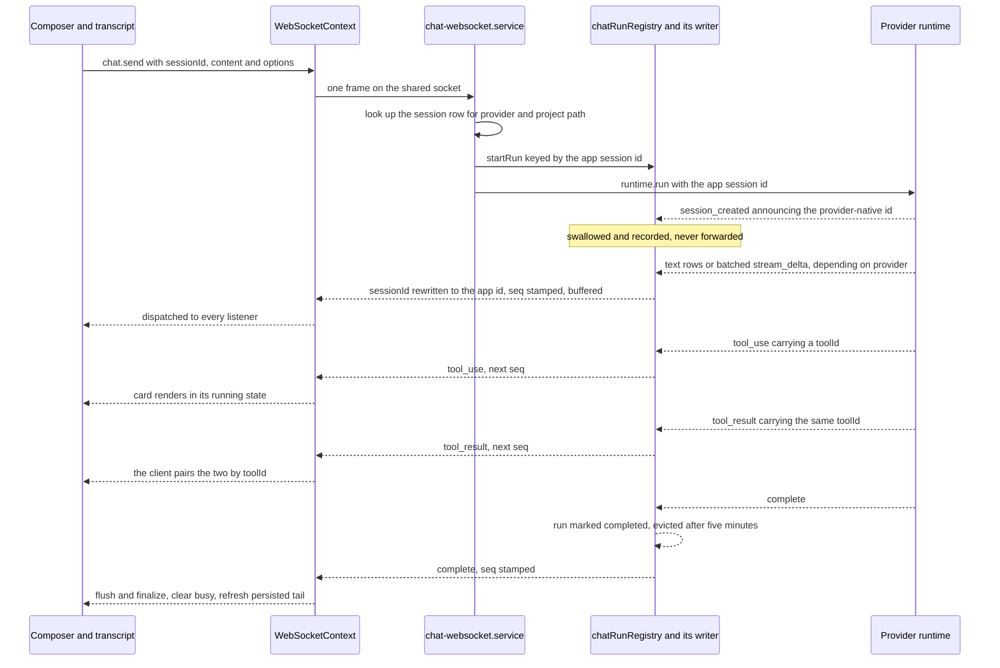
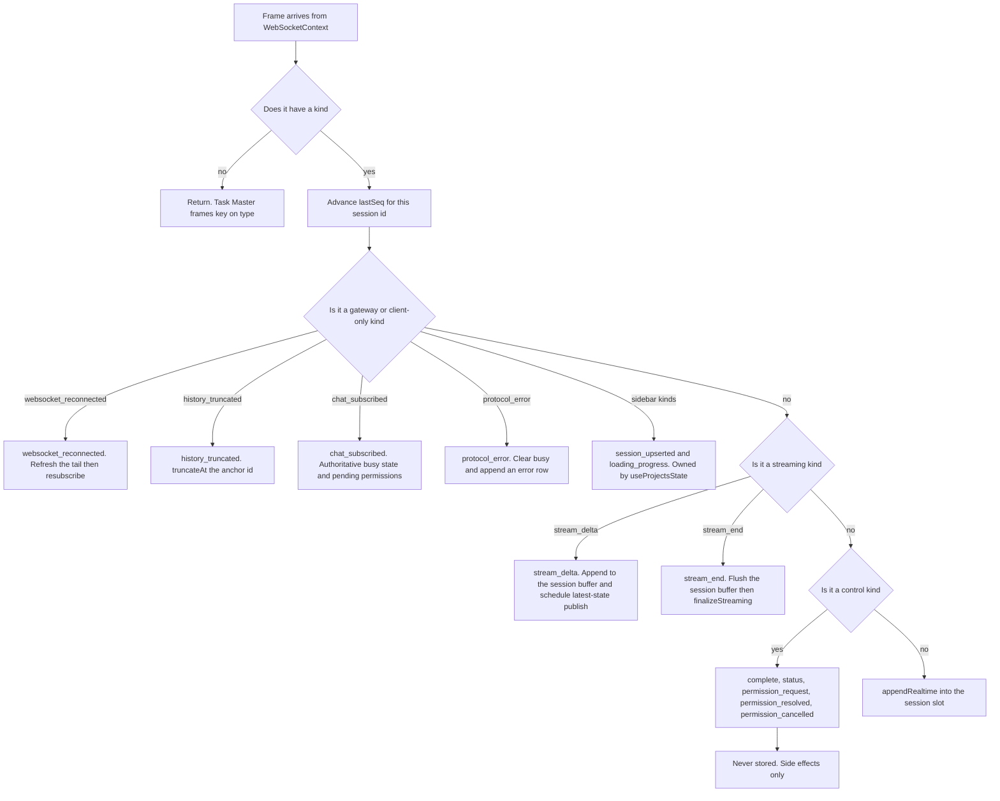
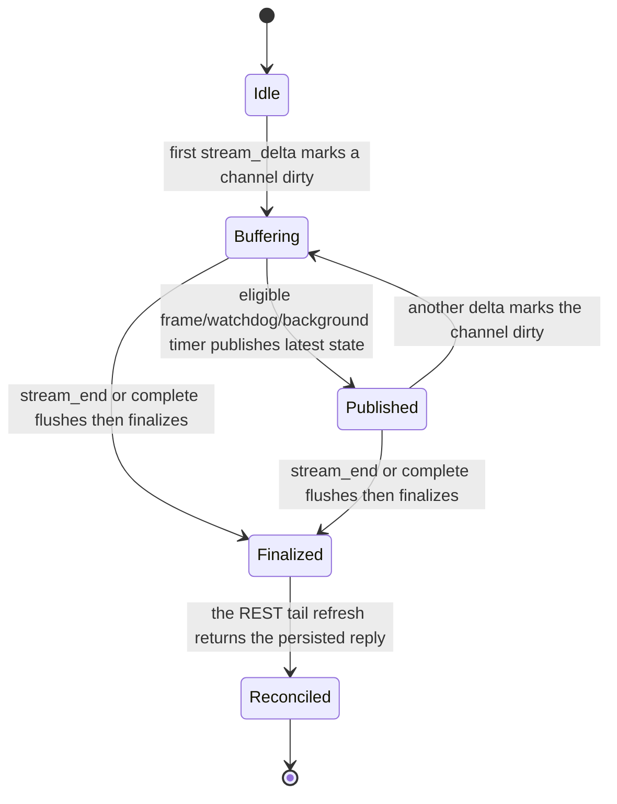

# The realtime stream

*One frame's journey from a provider CLI to a rendered row, and the buffer that keeps a
fast reply from re-rendering the transcript on every token. The socket itself is
[the websocket layer](./01-websocket-transport.md); which session id a frame carries is
[conversation handoff](./03-conversation-handoff.md); how a tool frame becomes a card is
[tool views](./06-tool-view.md).*

## In one paragraph

Provider CLIs speak different dialects. Each provider's runtime translates its output
into one shape — `NormalizedMessage`, discriminated by a `kind` field — and hands it to a
50 ms / 2048-character delta batcher, then a gateway writer that rewrites the session id, stamps a per-run `seq`, buffers it for
replay, and fans it out to every socket watching that run. On the client there is exactly
one listener for all of it: `useChatRealtimeHandlers` switches on `kind` and, for almost
every kind, appends the frame to the viewed session's slot in `useSessionStore`. The one
exception is `stream_delta`. Deltas do not reach the store directly; a session-keyed
registry accumulates them and publishes the latest full string into synthetic rows. The
visible session uses an animation-frame pump capped around 30Hz with a 100ms watchdog;
hidden sessions publish at most 5Hz. A reply that streams for thirty seconds is therefore
one row whose content grows rather than a thousand rows.

## Mental model

Eight rules. If you can apply these, you can predict what the code does without reading
it.

1. **Every server-to-client frame carries a `kind`, and one function reads it.**
   `src/modules/chat/hooks/useChatRealtimeHandlers.ts` is the only place in chat that
   touches a raw frame. It does not branch on provider, does not navigate, and does not
   translate session ids — the backend has already done all three. A frame with no `kind`
   is dropped on the first line, which is what makes Task Master's `type`-keyed
   broadcasts invisible to chat.
2. **The default action is "append to the store".** Read the switch as a filter, not a
   dispatcher: gateway kinds and the two streaming kinds are handled specially, five
   kinds are control events that are deliberately *not* stored, and everything else —
   `text`, `tool_use`, `tool_result`, `thinking`, `error`, `task_notification` — just
   becomes a row.
3. **A streaming reply is one row, not many.** `updateStreamingBatch` writes a row with the id
   `__streaming_<sessionId>` and replaces it in place on every flush. The transcript's
   row count stays flat while the text grows. The row also receives a stable client-side
   `segmentId`; `finalizeStreaming` may replace the store id while preserving that projection
   identity, and the persisted echo inherits it during reconciliation, so React does not
   remount the rendered row.
4. **Whether you see deltas at all depends on the provider.** Claude, Cursor, OpenCode,
   Pi and WorkBuddy currently run token deltas through `createDeltaBatcher`; Codex does
   not use that path. New token-stream Providers must emit appendable deltas rather than
   cumulative snapshots and must use the shared batcher.
5. **`complete` is the only terminal event. `error` is just a row.** Providers emit
   `error` for mid-run stderr and keep running. Clearing the busy state on `error` leaves
   a live run writing into a UI that believes it is idle.
6. **Busy state is not derived from messages.** It lives in a separate per-session map in
   `src/shared/hooks/useSessionProtection.ts`. The spinner, the abort button and the
   status text all read that map; the transcript reads the store. The two are only
   coupled by the handler writing to both.
7. **Live rows and persisted rows never mix in storage, only in projection.** The store
   keeps `realtimeMessages` and `serverMessages` in separate arrays and computes `merged`
   from them. `complete` triggers a REST refresh of the persisted tail; the live copy of
   the reply survives until the persisted copy demonstrably supersedes it. Details in
   [the message store](./04-message-store-and-lazy-loading.md).
8. **The registry belongs to the pane, but each buffer belongs to a session.** Concurrent
   sessions keep independent accumulated text, dirty snapshots and scheduler handles.
   The visible session gets frame-aligned publishing; hidden sessions keep accumulating
   but publish no faster than 5Hz.

## The pieces

| File | Role |
| --- | --- |
| `src/shared/context/WebSocketContext.tsx` | The one socket. Parses each frame and calls every registered listener synchronously. Synthesises the client-only `websocket_reconnected` frame on a re-open, and retries a dropped socket after 3 s. |
| `src/modules/chat/hooks/useChatRealtimeHandlers.ts` | The whole client-side protocol. One switch on `kind`; the streaming buffer; the `seq` bookkeeping. |
| `src/modules/chat/ChatInterface.tsx` | Owns the pane-wide stream registry, current-visible-session ref, `lastSeqRef` and `statusCheckSentAtRef`; visibility switches synchronously flush the latest buffered state before paint. |
| `src/modules/chat/utils/streamingBufferRegistry.ts` | Keeps one authoritative text/thinking buffer per session; schedules visible rAF/watchdog and hidden 200ms publishing; emits one atomic dirty-channel batch. |
| `src/modules/chat/hooks/useSessionStore.ts` | Per-session slots. `appendRealtime`, atomic `updateStreamingBatch`, compatibility `updateStreaming`, `finalizeStreaming`, `truncateAt`, and the merge of live and persisted rows. |
| `src/modules/chat/hooks/useChatMessages.ts` | `normalizedToChatMessages` — the projection from store records to UI objects. Pairs `tool_use` with `tool_result`, folds subagent rows into their container, and memoises through a `WeakMap`. |
| `src/modules/chat/hooks/useChatSessionState.ts` | Sends `chat.subscribe` on session open and reconnect, owns `requestLatestMessages`, projects store rows and schedules the transcript's guarded follow frame. |
| `src/modules/chat/hooks/useChatComposerState.ts` | The outbound side: `chat.send`, `chat.edit-send`, `chat.abort`, `chat.permission-response`, plus the optimistic user echo. |
| `src/shared/hooks/useSessionProtection.ts` | The per-session activity map that the indicator and the abort button derive from. |
| `src/modules/chat/transcript/StreamingMarkdown.tsx` | Renders an assistant reply, streaming or finished, as a settled half plus a pending half. |
| `src/modules/chat/utils/streamingMarkdown.ts` | `splitStreamingMarkdown` — where it is safe to cut a partially-written markdown document in two. |
| `src/shared/types.ts` | `ServerEvent` at `:204`, the client's view of a frame. Every field the handler reads is optional here. |
| `server/modules/websocket/services/chat-websocket.service.ts` | Handles `chat.send`, `chat.edit-send`, `chat.abort`, `chat.subscribe`, `chat.permission-response`. Registers the run, then hands the turn to the provider runtime. |
| `server/modules/websocket/services/chat-run-registry.service.ts` | One entry per app session. `decorateAndRecordEvent` at `:84` is the choke point: session-id rewrite, `seq` assignment, replay buffering, terminal-`complete` de-duplication. |
| `server/modules/websocket/services/chat-session-writer.service.ts` | The object provider runtimes think is their socket. Swallows `session_created`; `forward` at `:160` fans out to every watching connection and collects dead ones. |
| `server/shared/utils.ts` | `createNormalizedMessage` at `:348` and `createCompleteMessage` — the envelope every provider event is built with. **Not** `message-unification.ts`; that file exports only `prepareTranscriptMessages`, which runs on REST history reads and never on the live path. |
| `server/shared/types.ts` | `MessageKind` at `:178` — the fifteen kinds a provider can emit. `GatewayEventKind` at `:204` — the four the gateway adds. |
| `server/modules/providers/list/*/` | Per provider, a `*-runtime.provider.js` that drives the CLI or SDK and a `*-sessions.provider.ts` whose `normalizeMessage` converts one raw event into `NormalizedMessage[]`. |

Tests worth knowing about: `streamingMarkdown.test.ts` and
`streamingMarkdownRenderEquivalence.test.tsx` pin the split; `messageStreamEnd.test.tsx`
pins the DOM-identity rule; `tokenBudgetSessionScope.test.tsx` pins the token-counter
scoping; `liveSubagentGrouping.test.ts` pins the subagent fold;
`sessionStoreTruncate.test.tsx` pins `truncateAt`. All in `src/modules/chat/tests/`.

## One run, end to end

Three things in that picture are easy to get backwards:

- **The client never sees the provider's session id.** `session_created` is consumed by
  the writer, turned into a database mapping, and dropped. Every other frame has its
  `sessionId` overwritten with the app id.
- **`tool_use` and `tool_result` are paired on the client, not the server.** Claude's
  runtime emits them as separate frames, often far apart. OpenCode is the exception: it
  can attach a result inline on the `tool_use` frame, so the projection checks
  `msg.toolResult` first and only then consults its map of `toolId` to result row.
- **The run outlives the socket.** It is keyed by app session id in the registry, keeps
  its last 5000 events for replay, and stays available for five minutes after finishing.
  A reconnecting client sends `lastSeq` and gets only what it missed — and only if the
  run is still running, because a completed run is already on disk and served over REST.

## What each provider actually emits

The unified `kind` vocabulary is a superset. The table below intentionally records only
the live streaming contract; tool, permission and history capabilities remain Provider
specific and are covered by the Provider integration SOP.

| Provider | Token `stream_delta` | `stream_end` | Shared server batcher |
| --- | --- | --- | --- |
| Claude | yes, text and thinking partials | yes, on `message_stop` | yes |
| Codex | no token-stream path | no | no |
| Cursor | yes | **never**; `complete` finalizes defensively | yes |
| OpenCode | yes | yes | yes |
| Pi | yes, text and thinking | yes | yes |
| WorkBuddy | yes, text and thinking | yes, on `message_stop` | yes |

Every “yes” in the last column means the runtime uses the same 50ms / 2048-character
`createDeltaBatcher`. Runtime fixtures must prove that each channel's emitted deltas join
exactly to its final text; a cumulative-full-text frame would duplicate content in the
client accumulator and is therefore a contract violation.

**Cursor emits `stream_delta` and never `stream_end`.** Its placeholder is finalized by
the defensive flush inside `complete`. Any change that makes finalization depend solely
on `stream_end` breaks Cursor silently.

`task_notification` is in the kind union but has no live producer. It reaches the
transcript two other ways: `codex-sessions.provider.ts` builds it when reading history,
and the client synthesises it locally in `useChatSessionState.ts` when converting a UI
message back into a store record.

## The client reducer

The `shouldPersist` test is literally five inequalities, and the list is worth memorising
because looking for these kinds in the transcript array is futile: **`complete`,
`status`, `permission_request`, `permission_resolved` and `permission_cancelled` are
never stored.** They exist to move the busy map, the token counter and the permission
list.

`lastSeqRef` is advanced for every frame that carries a numeric `seq`, and only ever
forward. It is read when a `chat.subscribe` is sent — on session open and on reconnect —
so the server replays exactly the gap. There is no reordering buffer: frames are applied
in arrival order, which is safe because one TCP connection preserves order and replay is
emitted in buffer order.

## Text streaming

A provider that streams emits deltas faster than a transcript should re-render. Every
current token-stream runtime first uses `createDeltaBatcher`: consecutive same-channel
deltas are joined for up to 50ms or until 2048 characters accumulate. A channel or
provider change flushes the previous batch before accepting the next one.

The client registry then keeps the complete accumulated `text` and `thinking` strings per
session. The visible session publishes dirty channels on the next animation frame, with a
32ms minimum between publishes and a 100ms watchdog if frames do not run. Hidden sessions
do not request animation frames and publish at most once per 200ms. Every publish carries
the latest complete channel string — not the increment — and a dual-channel publish enters
the store as one atomic batch with one merge and one active-session notification.

Two flushes are defensive rather than routine. `stream_end` synchronously flushes dirty
channels, finalises their rows and drops that session's buffer. The `complete` branch does
the same when a buffer still exists, which carries Cursor — where `stream_end` never
arrives — and any provider whose run dies mid-reply. The sequence remains synchronous:
`flushNow → finalizeStreaming → drop`.

`Finalized` and `Reconciled` are different rows in the same array position at different
times. Finalising swaps the synthetic `__streaming_` id for a unique
`text_<timestamp>_<random>` one and flips `kind` to `text`; the persisted reply that
arrives moments later has yet another id. Their client-side `segmentId` remains stable.
The store collapses the pair —
`pruneRealtimeSupersededByServer` drops the live row when the same assistant text is
already in the persisted turn, and `dedupeAdjacentAssistantEchoes` catches whatever slips
past into `merged`. Without both, every completed reply would briefly appear twice.

## Incremental markdown rendering

Republishing the whole growing reply around 20Hz for current Provider batches, with a
30Hz client ceiling, would make a full parse O(length²) over a reply. `StreamingMarkdown` fixes
that by cutting the text into a **settled** prefix and a **pending** tail at a safe block
boundary and rendering them as two memoised `<MarkdownBody>` siblings. The settled half's
props change only when a block completes, so a publish re-parses one block.

The whole thing rests on one property, and the source states it precisely:

> Correctness rests on markdown blocks being independent across a blank line: rendering
> `settled` and `pending` as two documents must equal rendering their concatenation. That
> does NOT hold inside a fenced code block, a display-math block, a list, a blockquote, a
> table, an indented code block, or across a link-reference/footnote definition and its
> usage — the boundary search skips all of them.
> — `src/modules/chat/utils/streamingMarkdown.ts:12-17`

`splitStreamingMarkdown` walks the lines tracking the open code fence and `$$` math
state, and considers only blank lines that are outside both. A blank line is rejected as
a boundary if the nearest non-blank line on **either** side matches
`CONTEXT_SENSITIVE_LINE` — a list item, an indented continuation, a blockquote, a table
row, or a link-reference definition. The **last** surviving candidate wins, so the
settled half is as long as it can safely be.

Three surprises, all of them intended:

- **Settled blocks can un-settle.** The boundary is recomputed from scratch each tick, so
  a paragraph that was settled goes back to pending as soon as a list or a table starts
  after it. `streamingMarkdown.test.ts` has a monotonicity test, but it uses
  paragraphs-only content; monotonicity is not a general guarantee, and retraction is
  what keeps the two halves equal to the unsplit document. Measured at about a third of
  realistic replies, once each.
- **A block that crosses the boundary loses transient in-block state.** It changes parent,
  so its DOM is recreated: a code block's "Copied" tick and any text selection inside it
  are gone. Do not park state in a streamed block.
- **The same component renders finished replies**, with `isStreaming: false` and no split.
  That is deliberate. `MessageComponent` used to swap `<StreamingMarkdown>` for
  `<Markdown>` at that position, and React treats a different element type in the same
  position as a different component — so every reply threw away its DOM the moment it
  completed, destroying a selection the user had started. `messageStreamEnd.test.tsx`
  asserts on node identity, not HTML, because identity is what the browser keys a
  selection to.

## Run lifecycle and busy state

The activity indicator, the abort button and the status text all derive from one
`Map<sessionId, SessionActivity>` in `useSessionProtection`. Nothing in the transcript
feeds it. It is written in exactly four places:

| Event | Effect on the map |
| --- | --- |
| The composer sends | `markSessionProcessing(sessionId, { statusText: null, canInterrupt: true })`, before the frame goes out |
| `chat_subscribed` with `isProcessing` | Marks processing — this is the authoritative answer after a reload |
| `chat_subscribed` idle | Deletes the entry, **unless** a newer local request started after the subscribe was sent. That guard is `ifStartedBefore`, compared against `startedAt` |
| `complete` or `protocol_error` | Deletes the entry |

The `complete` branch runs in a fixed order: flush and finalise streaming text, delete the
busy entry, clear pending permissions for the viewed session, then branch on outcome.

| Outcome | Signal | What the client does |
| --- | --- | --- |
| Aborted | `msg.aborted` | Nothing further. Clearing the entry was the whole job |
| Failed | `msg.success === false` | No sound, no title indicator |
| Succeeded | neither | Title indicator plus completion sound |

Then, **for the viewed session only**, `requestLatestMessages` re-reads the persisted
tail. A background session that finishes keeps its live rows until it is opened.

Abort is a server-side transaction. `chat.abort` requires a run in `running` status —
otherwise the server answers `protocol_error` with code `NO_ACTIVE_RUN` — then kills the
runtime and calls `completeRun` with `aborted: true`. The killed process usually emits its
own `complete` a moment later; `decorateAndRecordEvent` drops it, because a run already
marked completed cannot complete twice. The partial reply that streamed before the abort
stays in the transcript as an ordinary assistant row.

`error` is not part of any of this:

> 'error' is an informational message row, not a terminal event — providers emit it for
> mid-run stderr output too. Run teardown is always signalled by the unified 'complete'
> that follows.
> — `useChatRealtimeHandlers.ts:281-283`

The token counter deserves one line here because it travels as a `status` frame:
`status` with `text === 'token_budget'` sets the counter, **but only when the frame's
session is the one on screen** — otherwise a second session running in the background
would overwrite the number the user is looking at. `tokenBudgetSessionScope.test.tsx`
pins both directions. The counter shows context-window occupancy, not the turn's bill;
feeding it a summed `result.usage` is what made it bounce before commit `ab13376d`.

The other arm of the `status` branch — the one that writes `statusText` and `canInterrupt`
into the activity map — **has no producer today.** All three `status` emitters
(`claude-runtime.provider.js:968`, `codex-runtime.provider.js:406`,
`opencode-runtime.provider.js:338`) send `text: 'token_budget'`. The arm is live code
kept for a provider that reports progress text; do not delete it expecting nothing to
change, and do not assume the status text you see in the UI came from it.

## Permission requests

Claude is the only provider with interactive tool approvals. Its runtime's `canUseTool`
callback emits `permission_request` with a `requestId` and blocks until the client answers
with `chat.permission-response`. When an answer arrives it emits `permission_resolved`
with the same id; if the run ends or the request times out it emits `permission_cancelled`
instead. The distinction matters because the answer itself travels only on the inbound
socket: without the outbound `permission_resolved`, the `permission_request` sitting in
the replay buffer had nothing to retract it, so a mid-run page refresh resurrected an
already-answered prompt — and a second tab kept it forever. `permissionPromptReplay.test.tsx`
pins the replayed request-then-resolution netting out to nothing.

The client keeps the pending list in `ChatInterface` state, not in the store — permission
kinds are among the five that are never persisted as rows. The rules:

- A request plays a notification sound, **except** for `ExitPlanMode` / `exit_plan_mode`,
  which are not actionable prompts.
- The list is only maintained for the **viewed** session. A request for a background
  session still marks that session processing and still plays the sound, but does not
  enter the list.
- Duplicate `requestId`s are ignored, because `chat_subscribed` also carries the full
  pending set and can race with a live `permission_request`.
- `permission_resolved` and `permission_cancelled` remove their `requestId` from the
  list, whichever tab or replay delivered the request.
- `chat_subscribed` replaces the list wholesale, and plays the sound only on the
  transition from "no actionable requests" to "some".
- `complete` empties the list for the viewed session.

## Cross-session behaviour

The store and streaming registry are both session-keyed. Each session owns independent
text/thinking accumulators, published snapshots, frame/timer handles and Provider metadata,
so concurrent runs cannot concatenate into one another or write raw background deltas as
separate rows.

`ChatInterface` exposes the current visible session to the registry. That session uses the
frame-aligned foreground cadence. Every other session continues accumulating all deltas but
publishes into its store slot at most every 200ms, avoiding foreground-rate merge work for
content React cannot display. When a session becomes visible, a layout effect synchronously
flushes its dirty latest state before the first paint; intermediate background snapshots are
not replayed. Terminal `stream_end` / `complete` always flush synchronously regardless of
visibility.

Everything else is per-session and behaves: `lastSeqRef` and `statusCheckSentAtRef` are
`Map`s keyed by session id, the busy map is keyed by session id, the token counter is
scoped to the viewed session, and `appendRealtime` targets the frame's own slot regardless
of what is on screen.

The multi-*client* story is the opposite — deliberately shared. A run's writer holds every
subscribed connection, so a second tab or a phone gets the same live stream, and
`history_truncated` reaches all of them so an edit made in one tab does not leave the
question rendered twice in another.

## Gotchas and why the code looks like this

- **`createNormalizedMessage` lives in `server/shared/utils.ts`, not
  `message-unification.ts`.** That filename is the most misleading in the subsystem:
  `message-unification.ts` exports exactly one function, `prepareTranscriptMessages`, and
  it runs on REST history reads for Claude and Codex only. No live frame passes through
  it.
- **`__streaming_<sessionId>` is a real id that appears in the store.** It is matched by
  name in `pruneRealtimeSupersededByServer`. Code that assumes every row id came from a
  provider will trip over it.
- **`finalizeStreaming` mutates the array slot in place.** It does not remove and append.
  The id changes underneath the same position, on purpose, so React reconciles the
  existing DOM and a text selection survives the end of the reply.
- **A streaming reply re-triggers one coalesced follow frame.** The follow effect depends
  on the `chatMessages` array identity, not only its length, so an in-place row replacement
  still schedules a pinned transcript update. User scroll intent is rechecked immediately
  before the write. See [scrolling](./05-scrolling.md).
- **Every publish carries the whole accumulated channel, not the delta.** Anyone optimising this
  into an incremental append has to also handle the case where a flush is skipped, which
  is exactly what the current design makes impossible to get wrong.
- **`error` does not end a run and does not clear the spinner. `protocol_error` does
  both.** A protocol error means the frame was rejected before a run existed —
  `SESSION_NOT_FOUND`, `UNSUPPORTED_PROVIDER`, `RUN_IN_PROGRESS`, `NO_ACTIVE_RUN` — so no
  `complete` will follow and nothing else would ever clear the busy state.
- **Only `protocol_error` synthesises a message row on the client.** Every other row
  originates from a provider or from the local optimistic echo.
- **Realtime rows are capped at 500 per session** (`MAX_REALTIME_MESSAGES`), oldest
  dropped. A tool-heavy run can exceed that; the persisted transcript is the fallback.
- **The server's replay buffer is 5000 events per run, retained 5 minutes after
  completion**, and completed runs are deliberately *not* replayed on subscribe — they
  are already served by the history endpoint, and replaying them would duplicate rows.
- **Subagent rows must be skipped in the second projection pass.** They are folded into
  their `Task` container in the first pass by `parentToolUseId`; dropping the
  `if (msg.parentToolUseId) continue` guard renders every subagent tool twice.
- **A `tool_result` whose `tool_use` is not in the loaded window renders nothing.** That
  is intentional: it is almost always a pair split across a pagination boundary, and
  rendering the raw content produced an unstyled dump that "fixed itself" on the next
  page load.
- **The projection cache is keyed on more than the source record.** A `tool_use` record is
  unchanged when its result arrives, and unchanged when its subagent timeline grows, so
  `CachedMessageProjection` stores `toolResultSource` and `subagentActivitySource`
  alongside the projected messages and requires both to match for a cache hit.
- **When a mid-run refresh attaches a partial server subagent timeline, the longer of the
  two lists wins.** Otherwise a refresh mid-run would visibly shorten a panel.
- **Never split streaming markdown inside a fence, list, table, blockquote or math
  block.** Extend `CONTEXT_SENSITIVE_LINE`; do not relax it. The equivalence property is
  the only thing making the two-half render legal.
- **`stream_end` from a background session is still terminal.** It synchronously publishes
  any dirty latest state, finalizes the session's placeholders, then drops only that buffer.
- **Frames without `kind` are dropped before anything else happens.** If events are
  clearly arriving and nothing renders, check that first.

## If you change this, check that

| If you touch | Also check |
| --- | --- |
| The 32ms foreground interval, 100ms watchdog or 200ms hidden cadence | Re-run registry cadence tests and the per-second Markdown/merge benchmark; terminal `flushNow` must remain synchronous. |
| `updateStreamingBatch`, compatibility `updateStreaming`, or the `__streaming_` id | `pruneRealtimeSupersededByServer` matches that id by name, and `dedupeAdjacentAssistantEchoes` special-cases a `stream_delta` row followed by an identical assistant `text` row. |
| `finalizeStreaming` | It must keep the array position and must not append. `messageStreamEnd.test.tsx` covers the DOM-identity half; the duplicate-bubble half is covered by the store's dedupe. |
| The `shouldPersist` filter | Adding a kind to it makes that kind renderable, which means `normalizedToChatMessages` needs a case for it or it silently disappears. |
| Anything in `splitStreamingMarkdown` | `streamingMarkdown.test.ts` for the boundary rules and `streamingMarkdownRenderEquivalence.test.tsx` for split-equals-unsplit on every prefix. Both must pass on the fenced and list fixtures. |
| A provider's `normalizeMessage` | Its runtime fixture must prove each channel's deltas concatenate to the final text, use `createDeltaBatcher`, and preserve channel transitions. |
| `decorateAndRecordEvent` or `seq` assignment | Reconnect replay is `seq > lastSeq` with no gap detection, and `lastSeqRef` only moves forward. Any non-monotonic `seq` silently loses events. |
| The `status` branch | Both arms. The `token_budget` arm is scoped to the viewed session on purpose, and the other arm currently has no producer — a new producer will start writing status text into the activity map for the first time. |
| Visible-session switching in `ChatInterface` | The previous foreground schedule must be cancelled/flushed, the newly visible buffer must catch up before paint, and hidden sessions must stay at or below 5Hz. |

Related: [the websocket layer](./01-websocket-transport.md) for the transport and the replay
contract, [the message store](./04-message-store-and-lazy-loading.md) for what happens to
a row after `appendRealtime`, [tool views](./06-tool-view.md) for how a paired
`tool_use` becomes a card, and [the index](./README.md) for the rest of the set.
